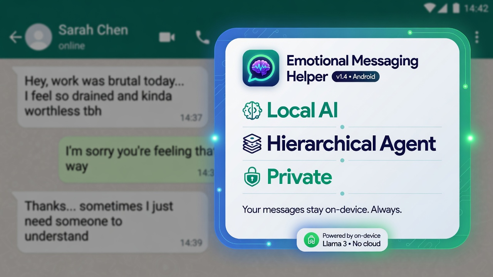
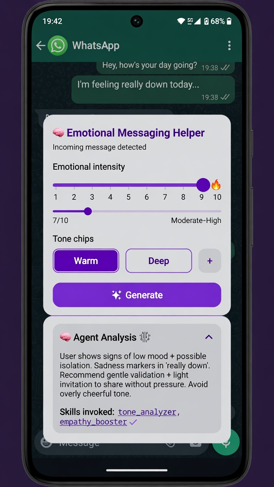
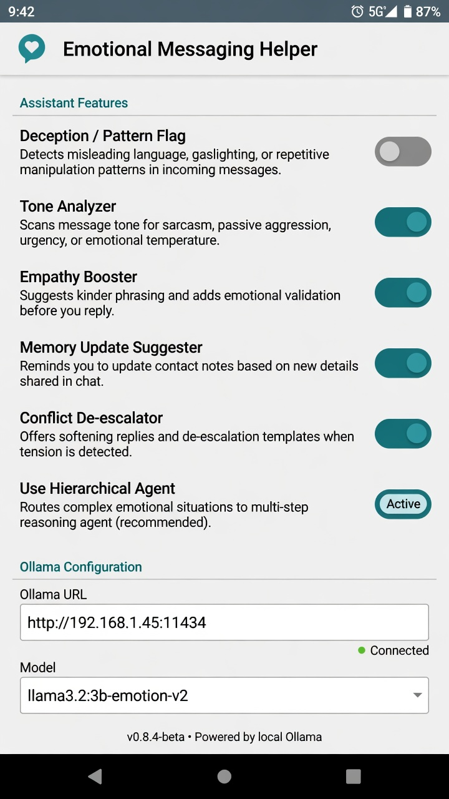
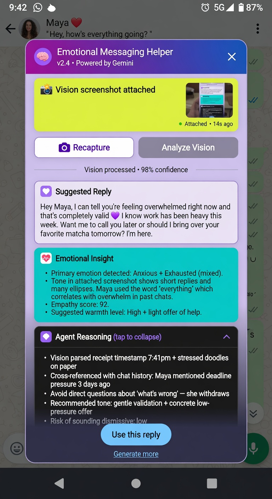
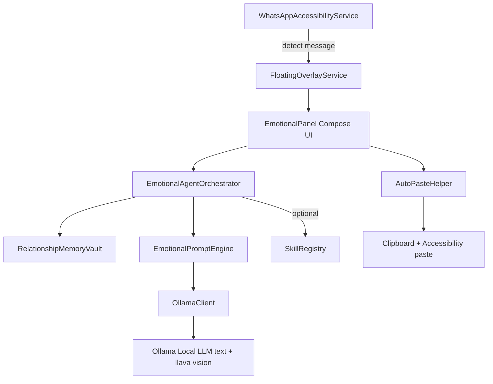

# Emotional Messaging Helper (EMH)



Android floating overlay app for WhatsApp that provides psychologically intelligent, emotionally fulfilling reply suggestions using **local AI** (Ollama).

**Local-first • Private • No cloud • Deep emotional intelligence**

## Features

| Feature                      | Description |
|------------------------------|-------------|
| Real-time WhatsApp Detection | Accessibility Service monitors chats live |
| Local AI (Ollama)            | Text + Vision (llava) – everything stays on your device |
| Hierarchical Emotional Agent | Multi-turn psychological depth + relationship memory (Phase 2) |
| Screenshot Vision Context    | Capture screen + analyze with vision models |
| Tone & Figurative Control    | 0-10 figurative slider + quick tone presets |
| Encrypted Relationship Memory| Per-contact notes & preferences (vault) |
| Extensible Skill System      | 5 lightweight skills (tone, deception, empathy, memory updates, conflict de-escalation) — all toggleable (Phase 2/3) |
| History + Restore            | Save generations, search, one-tap restore into panel |
| Smart Auto-Paste             | Direct accessibility paste + reliable clipboard fallback + haptics/toasts |
| Voice (TTS + Speech Input)   | Read replies aloud, speak context into the panel, auto-speak |
| Floating Overlay Panel       | Rich Compose UI with haptics, templates, vision UI |

## Screenshots

These are illustrative mockups of the key screens (real device captures recommended for releases — see `fastlane/metadata/.../graphics/README.txt` and `TESTING.md`).

### Main Floating Panel + Hierarchical Agent


### Skills Configuration in Settings


### Vision Context + Reply Generation


## Architecture



See `docs/architecture.md` for full details (includes Mermaid of the agent + skills loop + multi-frame vision).

**v0.3.1 (complete):** Hierarchical agent + 5 skills, multi-frame vision, memory export/import, bottom-sheet reasoning, voice (TTS + speech input), Gemma 3/4 support via Ollama, device test scripts, F-Droid/fastlane metadata. See [ROADMAP.md](ROADMAP.md) (COMPLETE) and [RELEASE.md](RELEASE.md).

## Quick Start (One-Click Ollama)

```bash
cd emotional-messaging-helper
./scripts/setup-ollama.sh
```

This pulls recommended models. YOLO Gemma edition:
- `gemma3:4b` or `gemma4:e4b` (strong reasoning + multimodal vision for screenshots — great for the agent)
- `gemma4:e2b` (lightest edge model)
- Or stick with `llama3.2` + `llava`

Gemma models are officially excellent with Ollama and optimized for edge/on-device use. See SETUP.md for on-device options (Google AI Edge Gallery).

Then open the project in **Android Studio**, sync, and run on a physical device.

**Full instructions:** See [SETUP.md](SETUP.md)

## Competitive Differentiation

| App                  | Local AI | Vision | Emotional Depth | Skills/Extensibility | Relationship Memory | Open Source |
|----------------------|----------|--------|-----------------|----------------------|---------------------|-------------|
| EMH (this)           | ✅ Yes  | ✅ llava (multi-frame) | ✅ Hierarchical Agent + 5 Skills (configurable) | ✅ Live + persisted toggles | ✅ Encrypted Vault + apply UX | ✅ Apache-2.0     |
| Replyfy / AutoResponder | ❌     | ❌     | 🟡 Basic templates | ❌                  | ❌                 | ❌         |
| Generic Ollama apps  | ✅      | 🟡 Limited | 🟡 Single-shot | ❌                  | 🟡 Basic           | Varies     |

EMH's moat is **psychological depth + local privacy + extensibility via skills** while staying 100% on-device.

## Phase Roadmap (High Level)

**Phase 1 (Done):** Professional docs, one-click Ollama script, paste reliability (multi-fallback + haptics), encrypted memory export methods.

**Phase 2 (Done — Core Moat):** Hierarchical Emotional Agent Orchestrator + Skill System.
- Agent now drives all reply generation.
- 5 skills active and individually toggleable in Settings (with live DataStore persistence): deception_flag, tone_analyzer, empathy_booster, memory_update, conflict_deescalator.
- Recent history (last 3 turns) for multi-turn awareness.
- Full agent reasoning visible (expandable + copy + dialog) and skill notes enrich the prompt.
- Memory suggestions from skills are one-tap applyable.

**Phase 3 (Done):** Vision hardening, F-Droid/release prep, memory export UI, bottom-sheet reasoning, voice, testing scripts.

**Status:** Project complete at v0.3.1. See [ROADMAP.md](ROADMAP.md) and [TESTING.md](TESTING.md).

## License

Apache-2.0 (see LICENSE). Recommended for open community distribution and F-Droid compatibility. Personal, educational, and commercial use permitted with attribution.

See [RELEASE.md](RELEASE.md) for build/tag instructions.  
See [docs/architecture.md](docs/architecture.md) for detailed architecture + Mermaid.

## Contributing

See [CONTRIBUTING.md](CONTRIBUTING.md) and [SETUP.md](SETUP.md).

---

**Built autonomously with heavy iteration loops for reliability on real devices.**

## Device Testing

```bash
./scripts/test-android.sh    # ADB: phone or emulator
./scripts/test-waydroid.sh   # Linux Waydroid container
```

## Building for Release / F-Droid

See [RELEASE.md](RELEASE.md) for version bump, signed APK, tagging, and F-Droid submission steps.
